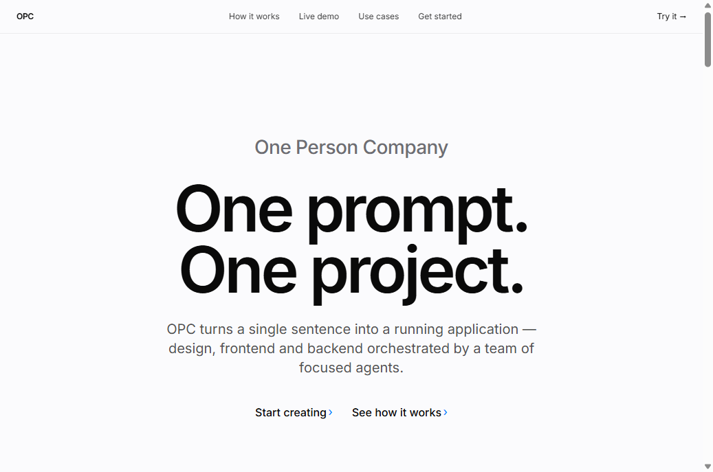
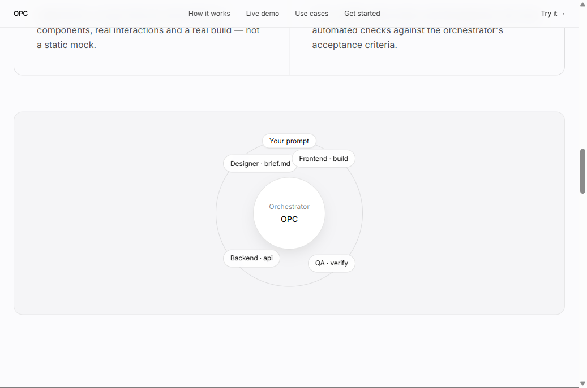
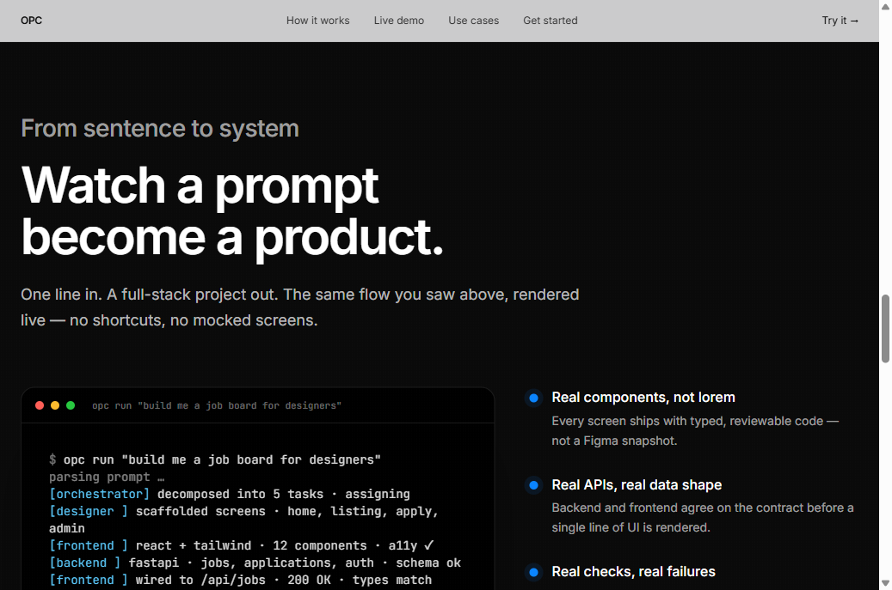
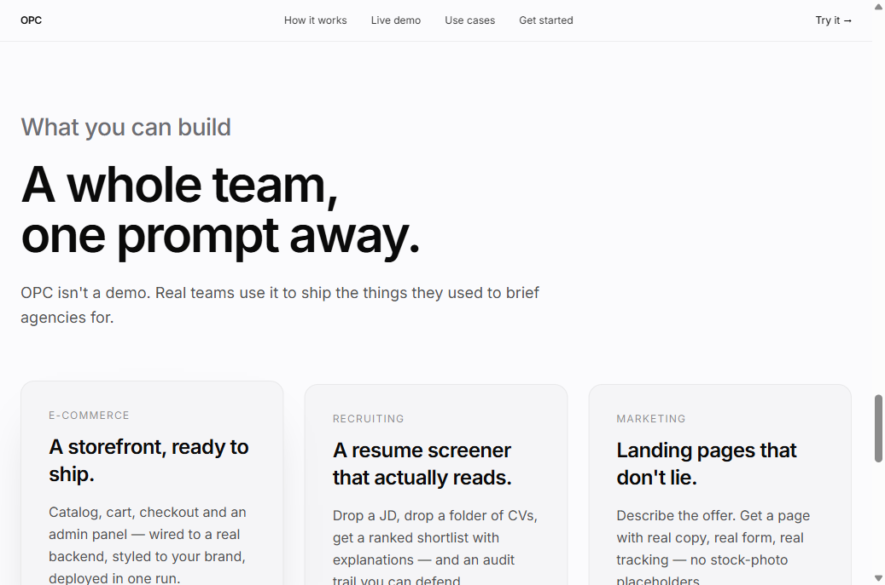

<div align="center">

# OPC — One Prompt Creates

**一句话生成一个完整应用，多 Agent 协同。**

[官网](https://haowenzheng-art.github.io/OPC/) · [PRD](docs/PRD.md) · [截图](docs/screenshots/) · [更新日志](docs/CHANGELOG.md)

---



</div>

---

## 这是什么

**OPC** 是一个面向 *One Person Company* 的多 Agent 编程系统。

你输入一句自然语言描述，OPC 后台的 6 个 AI 角色（**CEO / PM / Frontend / Backend / Test / Ops**）会协同工作，按真实工程团队的方式产出：

- 一份完整的 **PRD**（产品需求文档）
- **Next.js + TypeScript** 前端代码（Tailwind + shadcn/ui）
- **Express / FastAPI** 后端代码 + 数据库 schema
- **自动化测试** + 部署配置（Docker Compose）
- 一个**真的能跑**的项目，不是 mock

不是一个聊天机器人，是一个**会自检、能自修、能交付工件**的工程团队。

---

## 为什么做这个

个人 / 小团队写完整应用的成本：**想法 → 设计 → 前端 → 后端 → 测试 → 部署**，每一个环节都要懂、都要做、都要等。OPC 想把这条链上的每个角色变成一个**专注的 Agent**，让它们彼此交付、彼此验证，最后给出一份**可运行**的产物。

**核心信念**：
- *LLM 自由生成 + 多层防御* > 死板模板
- *真值校验* > 单测 PASS
- *工程稳定性* > 功能 demo

---

## 它怎么工作



```text
你的一句话
   │
   ▼
┌─────────────┐    把模糊意图拆成可执行任务
│ Orchestrator │ ──────────────────────────────┐
└─────────────┘                                │
        │  派单（带验收标准）                      ▼
   ┌────┼─────┬─────────┬────────┐    ┌──────────────────┐
   ▼    ▼     ▼         ▼        ▼    │ api_contract.json│
 CEO  PM  Designer Frontend Backend   │ design_spec.json │
                          │      │    └──────────────────┘
                          ▼      ▼         ▲
                       Test ──── Ops ──────┘
                          │      │
                          └─► 失败 → 回到对应 Agent 自修（Stage 2 Self-Repair）
```

1. **Orchestrator** 读你的一句话，拆任务、定验收，派给最合适的 Agent。
2. **每个 Agent** 独立交付一个工件（设计稿、前端代码、后端 schema、测试报告…）。
3. **Test Agent** 跑真实 e2e + API smoke + 类型检查，把任何失败信号回写到 `FailureSignal`。
4. **Orchestrator** 收到失败 → 调用对应 Agent 的 `repair_with_tools()`，**只局部 patch**，不重抽。
5. 全部通过 → 产出在 `./out/<project>/`，附带 `opc serve` 即可启动。

---

## 实际效果

> 输入：`build me a job board for designers`

```
$ opc run "build me a job board for designers"
[orchestrator] decomposed into 5 tasks · assigning
[designer   ] scaffolded screens · home, listing, apply, admin
[frontend   ] react + tailwind · 12 components · a11y ✓
[backend    ] fastapi · jobs, applications, auth · schema ok
[frontend   ] wired to /api/jobs · 200 OK · types match
[qa         ] smoke + e2e · 18/18 passed
[orchestrator] all acceptance criteria met · shipping
✓ ./out/jobboard  ·  opc serve  ·  http://localhost:5173
```



---

## 能做什么

| 场景 | OPC 产出 |
|---|---|
| **电商** | 商品目录 + 购物车 + 结算 + 后台管理，连真实后端和你的品牌一起打包 |
| **招聘** | 丢一份 JD + 一堆简历，拿到排序好的 shortlist + 每条的解释 + 可审计记录 |
| **营销** | 描述 offer，拿到一页真实落地页（真表单、真跟踪，不是 stock photo 占位） |
| **内部工具** | 后台、看板、CMS、爬虫控制台… |



---

## 关键技术决策

### 1. 多层防御（Multi-layer defense）

LLM 自由生成 ≠ 自由放任。OPC 每一层都有兜底：

- **类型契约层**：`api_contract.json` 是前后端唯一真理，生成阶段和修复阶段都强制先读
- **真值校验层**：`test_agent` 跑 Playwright + 真实 HTTP 请求，不是只 parse AST
- **自修层（Stage 2）**：检测到 4xx/5xx/TS 错 → 调用 `repair_with_tools()` 局部 patch，最多 3 轮
- **降级层**：真修不上时 fallback 到验证过的模板，不静默吞错

### 2. Stage 2 — Self-Repair Loop

> 完整记录：[STAGE2_SELF_REPAIR.md](STAGE2_SELF_REPAIR.md)

LLM 第一次写错是常态。OPC 不重抽整个项目，而是：
- 解析错误 → `FailureSignal(kind, msg, suggested_action, agent)`
- 让对应的 Agent **用工具局部改文件**（read_file → edit_file → bash verify）
- 改完回到 Test Agent 重新校验

单测 7/7 PASS，覆盖了真实场景下的"前端 fetch 调错 URL" → mock LLM 走完整 read→edit→verify 链。

### 3. 成本控制

`backend/app/agent/cost_tracker.py` + `llm.py` 共同管理：
- 每个 Agent 调用记 token、记 USD
- 单项目超预算自动降级（从 Claude Opus → Sonnet → 模板）
- 失败不浪费 token —— repair 阶段不重新生成整个 agent context

---

## 技术栈

**Backend** — Python 3.11+, FastAPI, SQLAlchemy + asyncpg + PostgreSQL, Celery + Redis, Anthropic SDK, Alembic

**Frontend** — Next.js 16, TypeScript, Tailwind CSS v4, shadcn/ui

**Orchestration** — 多 Agent 编排（Orchestrator / PM / Designer / Frontend / Backend / Test / Ops）+ Celery 异步任务队列 + Playwright 真实验证

**Deployment** — Docker Compose（postgres / redis / backend / celery / frontend）

---

## 怎么跑

### 快速开始（Docker Compose）

```bash
git clone https://github.com/haowenzheng-art/OPC.git
cd opc
cp backend/.env.example backend/.env
# 编辑 backend/.env 填入你的 LLM API key

docker compose up --build
```

打开 http://localhost:3000 注册账号 → 进 Dashboard → "New Project" → 写一句话。

### 本地开发

```bash
# Backend
cd backend
python -m venv .venv && source .venv/bin/activate   # Win: .venv\Scripts\activate
pip install -e .
alembic upgrade head
uvicorn app.main:app --reload --port 8000           # API
celery -A app.worker.celery_app worker --loglevel=info   # Worker

# Frontend
cd frontend
npm install && npm run dev                          # http://localhost:3000
```

### 跑测试

```bash
cd backend
pytest tests/ -v                                    # 单元测试
python stage2_test.py                               # Stage 2 自修端到端
python verify_baseline.py                           # Baseline 真值校验
```

---

## 仓库结构

```
opc/
├── backend/                FastAPI + Celery + Agent 编排
│   ├── app/
│   │   ├── agent/          Orchestrator + LLM + 各 Agent 实现
│   │   │   └── projects/   Designer / Frontend / Backend / Test Agents
│   │   ├── api/            REST endpoints
│   │   ├── core/           配置 / 安全 / 异常
│   │   ├── db/             SQLAlchemy models + migrations
│   │   ├── models/         Pydantic schemas
│   │   ├── services/       业务服务层
│   │   └── worker/         Celery 任务定义
│   ├── tests/              pytest 测试（Stage 2 单测等）
│   ├── alembic/            DB migrations
│   └── pyproject.toml
├── frontend/               Next.js + shadcn/ui + Tailwind v4
├── marketing-site/         营销官网（独立静态站，部署到 GitHub Pages）
│   ├── index.html
│   └── favicon.svg
├── docs/
│   ├── PRD.md              产品需求文档
│   ├── CHANGELOG.md        阶段更新记录
│   └── screenshots/        官网截图
├── legacy/                 原 TypeScript 原型（archived）
├── docker-compose.yml
├── STAGE2_SELF_REPAIR.md   Stage 2 自修机制详细说明
├── STAGE3_VISUAL.md        Stage 3 视觉生成
├── STAGE4_TEMPLATES.md     Stage 4 模板 fallback
├── BASELINE_RESULT_NEW1.md 真值测量 + 关键发现
└── UPGRADE_PLAN.md         总升级路线图
```

---

## 路线图

- [x] 多 Agent 协同生成（CEO / PM / Designer / Frontend / Backend / Test / Ops）
- [x] FastAPI 后端 + PostgreSQL + Redis + Celery
- [x] Next.js 前端 + Auth + Dashboard + Project Studio
- [x] Stage 2 Self-Repair Loop（前后端路由错配自修）
- [x] 真值 e2e 校验（Playwright + 真实 HTTP）
- [x] 营销官网（marketing-site/）
- [ ] WebSocket / SSE 实时任务进度推送
- [ ] Stripe 订阅 + 配额计费
- [ ] 模板市场（用户可发布 / 复用模板）
- [ ] 真部署（Vercel / Railway / 自托管 Docker）

---

## 贡献

PR / Issue 都欢迎。**最有价值的贡献**：
- 真实失败案例（让 Self-Repair 多覆盖一种错配）
- 新 Agent 角色（Designer / SRE / Security …）
- 模板（电商 / 招聘 / 营销 / 内部工具）
- 文档翻译

---

## License

MIT